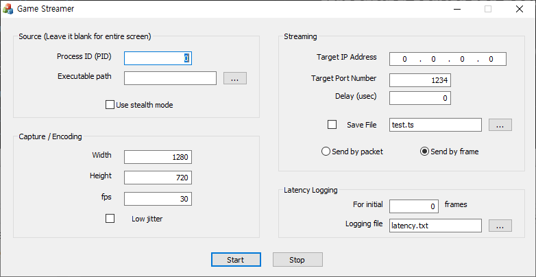

# MPEG2 TS over UDP streaming server for desktop or game screen(DirectX) streaming (small project)

## Prerequisites
- DirectX 9 SDK
- Windows classic samples (https://github.com/microsoft/Windows-classic-samples.git)

## Necessary code modification
test00Dlg.cpp line 42: \
\
static const GUID CLSID_DP = {0x3EFB6510,0xAE3B,0x4465,0xA5,0x1E,0x5E,0xC9,0x7E,0x55,0xA0,0xAC};\
\
Replace with class id of your own video encoder DMO.

## Executables
- test00.exe
- EasyHook32.dll
- test01.dll

## Screen shot

## License
GNU Lesser General Public License Version 3

